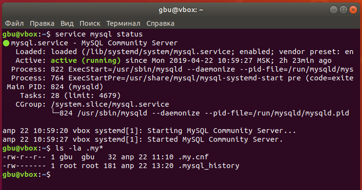
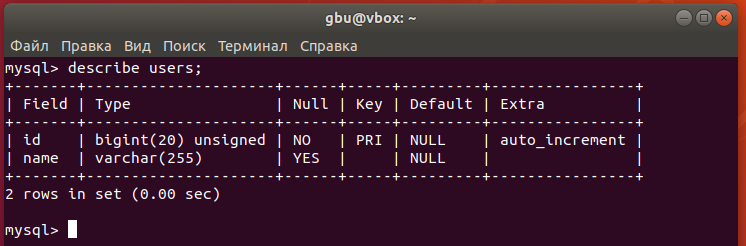
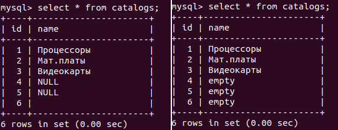
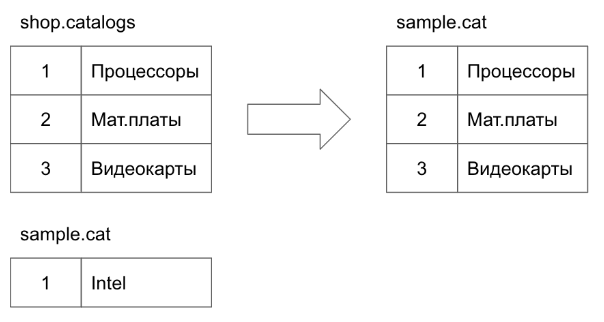

# Урок 1. Видеоурок «Быстрый старт. Язык запросов SQL.»
## Практическое задание тема №1
1. Установите СУБД MySQL. Создайте в домашней директории файл `.my.cnf`, задав в нем логин и пароль, который указывался при установке. 

2. Создайте базу данных `example`, разместите в ней таблицу `users`, состоящую из двух столбцов, числового `id` и строкового `name`.
```sql
CREATE DATABASE example;

USE example

CREATE TABLE IF NOT EXISTS users (
  id SERIAL PRIMARY KEY,
  name VARCHAR(255)
);
```


3. Создайте дамп базы данных `example` из предыдущего задания, разверните содержимое дампа в новую базу данных `sample`.
```bash
# создание дампа
mysqldump example > dump.sql
# создание базы sample из консоли
mysql -e "CREATE DATABASE sample"
# импорт дампа в новую базу
mysql sample < dump.sql
```

4. (по желанию) Ознакомьтесь более подробно с документацией утилиты `mysqldump`. Создайте дамп единственной таблицы `help_keyword` базы данных `mysql`. Причем добейтесь того, чтобы дамп содержал только первые 100 строк таблицы.
```bash
mysqldump mysql help_keyword -w "true LIMIT 100" > dump.sql
```

## Практическое задание тема №2
1. Пусть в таблице `catalogs` базы данных `shop` в строке `name` могут находиться пустые строки и поля принимающие значение **NULL**. Напишите запрос, который заменяет все такие поля на строку `‘empty’`. Помните, что на уроке мы установили уникальность на поле `name`. Возможно ли оставить это условие? Почему?

> уникальность не позволит хранить две записи со значением "пустая строка". замену так же мы не сможем произвести, т.к. все NULL, которых может быть несколько будут заменены на одно значение, т.е. получим ошибку:
`ERROR 1062 (23000): Duplicate entry 'empty' for key 'unique_name'`

```sql
-- удаляем индекс для задания
ALTER TABLE catalogs DROP INDEX unique_name;
-- заменяем значения
UPDATE catalogs SET name = 'empty' WHERE name = '' OR name IS NULL;
```



2. Спроектируйте базу данных, которая позволяла бы организовать хранение медиа-файлов, загружаемых пользователем (фото, аудио, видео). Сами файлы будут храниться в файловой системе, а база данных будет хранить только пути к файлам, названия, описания, ключевых слов и принадлежности пользователю.

> таблица `media` будет хранить информацию о файле
```sql
DROP TABLE IF EXISTS `media`;
CREATE TABLE `media` (
  `id` SERIAL PRIMARY KEY,
  `name` VARCHAR(50) NOT NULL,
  `desc` VARCHAR(500),
  `type` ENUM('photo', 'audio', 'video') NOT NULL DEFAULT 'photo',
  `path_id` BIGINT UNSIGNED NOT NULL,
  `owner_id` BIGINT UNSIGNED NOT NULL,
  `created_at` DATETIME DEFAULT CURRENT_TIMESTAMP,
  `updated_at` DATETIME DEFAULT CURRENT_TIMESTAMP ON UPDATE CURRENT_TIMESTAMP
);
```

> таблицы `media_path` и `media_tags` будут хранить пути до файлов различных типов и доступные теги

```sql
DROP TABLE IF EXISTS `media_path`;
CREATE TABLE `media_path` (
  `id` SERIAL PRIMARY KEY,
  `path` VARCHAR(210) NOT NULL
);

DROP TABLE IF EXISTS `media_tags`;
CREATE TABLE `media_tags` (
  `id` SERIAL PRIMARY KEY,
  `tag` VARCHAR(20)
);
```

> таблица связи многие-ко-многим для файлов и их тегов
```sql
DROP TABLE IF EXISTS `media_file_tag`;
CREATE TABLE `media_file_tag` (
  `id` SERIAL PRIMARY KEY,
  `media_id` BIGINT UNSIGNED NOT NULL,
  `tag_id` BIGINT UNSIGNED NOT NULL
);
```

> так же необходима таблица владельцев файлов
```sql
DROP TABLE IF EXISTS `users`;
CREATE TABLE `users` (
  `id` SERIAL PRIMARY KEY,
  `name` VARCHAR(255) NOT NULL,
  `created_at` DATETIME DEFAULT CURRENT_TIMESTAMP,
  `updated_at` DATETIME DEFAULT CURRENT_TIMESTAMP ON UPDATE CURRENT_TIMESTAMP
);
```

> добавим ограничения внешних ключей
```sql
ALTER TABLE `media` ADD CONSTRAINT `fk_owner`
  FOREIGN KEY (`owner_id`) REFERENCES `users` (`id`);

ALTER TABLE `media` ADD CONSTRAINT `fk_pathid`
  FOREIGN KEY (`path_id`) REFERENCES `media_path` (`id`);

ALTER TABLE `media_file_tag` ADD CONSTRAINT `fk_media_id`
  FOREIGN  KEY (`media_id`) REFERENCES `media` (`id`);

ALTER TABLE `media_file_tag` ADD CONSTRAINT `fk_tag_id`
  FOREIGN KEY (`tag_id`) REFERENCES `media_tags` (`id`);
```

> например так можно будет получить полное имя файла
```sql
SELECT concat_ws('/', mp.path, name) AS full_name
FROM media JOIN media_path AS mp ON path_id = mp.id;
```

> дамп [media_dump.sql](media_dump.sql)

3. (по желанию) В учебной базе данных `shop` присутствует таблица `catalogs`. Пусть в базе данных `sample` имеется таблица `cat`, в которой могут присутствовать строки с такими же первичными ключами. Напишите запрос, который копирует данные из таблицы `catalogs` в таблицу `cat`, при этом для записей с конфликтующими первичными ключами в таблице `cat` должна производиться замена значениями из таблицы `catalogs`. Попробуйте выполнить это одним SQL запросом.


> с данной задачей поможет справиться `ON DUPLICATE KEY UPDATE`
```sql
INSERT INTO
  `sample`.`cat`
SELECT * FROM `shop`.`catalogs` AS `sc`
  ON DUPLICATE KEY UPDATE `name` = `sc`.`name`;
```