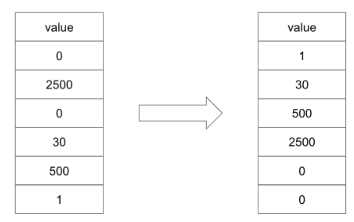
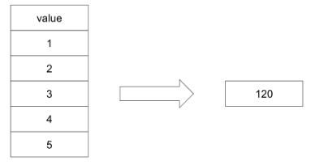

# Урок 3. Видеоурок «Операторы, фильтрация, сортировка и ограничение. Агрегация данных»
## Практическое задание тема №3
1. Пусть в таблице `users` поля `created_at` и `updated_at` оказались незаполненными. Заполните их текущими датой и временем.
> solution file: [t3ex1_filldate.sql](topic3/t3ex1_filldate.sql)

2. Таблица `users` была неудачно спроектирована. Записи `created_at` и `updated_at` были заданы типом `VARCHAR` и в них долгое время помещались значения в формате `"20.10.2017 8:10"`. Необходимо преобразовать поля к типу `DATETIME`, сохранив введеные ранее значения.
> solution file: [t3ex2_users_refactoring.sql](topic3/t3ex2_users_refactoring.sql)

3. В таблице складских запасов `storehouses_products` в поле `value` могут встречаться самые разные цифры: 0, если товар закончился и выше нуля, если на складе имеются запасы. Необходимо отсортировать записи таким образом, чтобы они выводились в порядке увеличения значения `value`. Однако, нулевые запасы должны выводиться в конце, после всех записей.

> solution file: [t3ex3_sorting.sql](topic3/t3ex3_sorting.sql)

4. (по желанию) Из таблицы `users` необходимо извлечь пользователей, родившихся в августе и мае. Месяцы заданы в виде списка английских названий `('may', 'august')`

> solution file: [t3ex4_case_month.sql](topic3/t3ex4_case_month.sql)

5. (по желанию) Из таблицы `catalogs` извлекаются записи при помощи запроса. `SELECT * FROM catalogs WHERE id IN (5, 1, 2);` Отсортируйте записи в порядке, заданном в списке `IN`.

> solution file: [t3ex5_sortbyin.sql](topic3/t3ex5_sortbyin.sql)

## Практическое задание тема №4
1. Подсчитайте средний возраст пользователей в таблице `users`
> solution file: [t4ex1_avg_age.sql](topic4/t4ex1_avg_age.sql)

2. Подсчитайте количество дней рождения, которые приходятся на каждый из дней недели. Следует учесть, что необходимы дни недели текущего года, а не года рождения.
> solution file: [t4ex2_bd_count.sql](topic4/t4ex2_bd_count.sql)

3. (по желанию) Подсчитайте произведение чисел в столбце таблицы

> solution file: [t4ex3_multiply.sql](topic4/t4ex3_multiply.sql)
