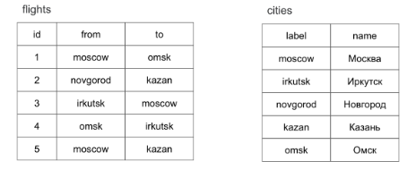

# Урок 5. Видеоурок "Сложные запросы. Транзакции, переменные, представления. Администрирование MySQL"
## Практическое задание тема №5
1. Составьте список пользователей `users`, которые осуществили хотя бы один заказ `orders` в интернет магазине.
> solution file: [t5ex1_join.sql](topic5/t5ex1_join.sql)

2. Выведите список товаров `products` и разделов `catalogs`, который соответствует товару.
> solution file: [t5ex2_join.sql](topic5/t5ex2_join.sql)

3. (по желанию) Пусть имеется таблица рейсов `flights` **(id, from, to)** и таблица городов `cities` **(label, name)**. Поля `from`, `to` и `label` содержат английские названия городов, поле `name` — русское. Выведите список рейсов `flights` с русскими названиями городов.

> solution file: [t5ex3_join.sql](topic5/t5ex3_join.sql)

## Практическое задание тема №6
1. В базе данных shop и sample присутствуют одни и те же таблицы, учебной базы данных. Переместите запись id = 1 из таблицы shop.users в таблицу sample.users. Используйте транзакции.
2. Создайте представление, которое выводит название name товарной позиции из таблицы products и соответствующее название каталога name из таблицы catalogs.
3. (по желанию) Пусть имеется таблица с календарным полем created_at. В ней размещены разряженые календарные записи за август 2018 года '2018-08-01', '2016-08-04', '2018-08-16' и 2018-08-17. Составьте запрос, который выводит полный список дат за август, выставляя в соседнем поле значение 1, если дата присутствует в исходном таблице и 0, если она отсутствует.
4. (по желанию) Пусть имеется любая таблица с календарным полем created_at. Создайте запрос, который удаляет устаревшие записи из таблицы, оставляя только 5 самых свежих записей.

## Практическое задание тема №7 (по желанию)
1. Создайте двух пользователей которые имеют доступ к базе данных shop. Первому пользователю shop_read должны быть доступны только запросы на чтение данных, второму пользователю shop — любые операции в пределах базы данных shop.
2. (по желанию) Пусть имеется таблица accounts содержащая три столбца id, name, password, содержащие первичный ключ, имя пользователя и его пароль. Создайте представление username таблицы accounts, предоставляющий доступ к столбца id и name. Создайте пользователя user_read, который бы не имел доступа к таблице accounts, однако, мог бы извлекать записи из представления username.
